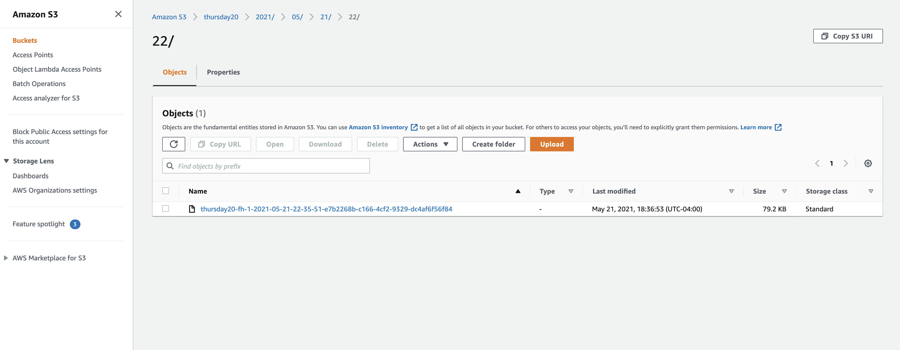
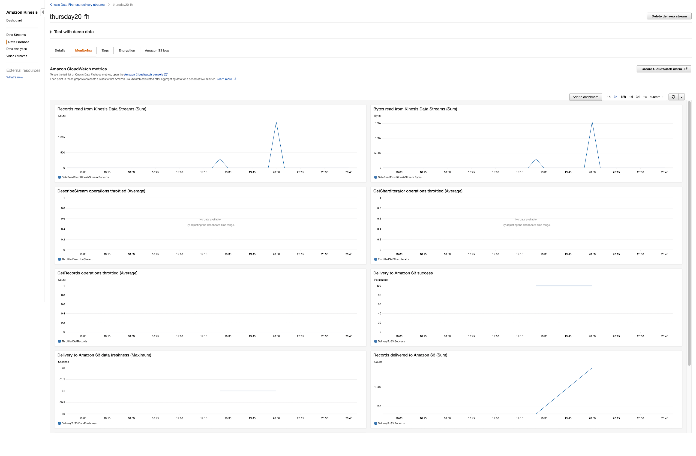

# Streaming Finance Data with AWS Lambda

In this project we used yfinance package and performed queries on 10 chosen stock for the date May 11th, 2021.With provisioning Amazon AWS Lambda Function, we generate near real time finance data and consume it.

This project consists of three major infrastructure elements that work in tandem:
1.	A **Lambda** function that gathers our data (DataTransformer)
2.	A **Kinesis** stream that holds our data (DataCollector)
3.	A serverless process that allows us to query our S3 data by configuring **AWS Glue** and using **AWS Athena** (DataAnalyzer)

# S3 Bucket

# AWS Kinesis configuration

